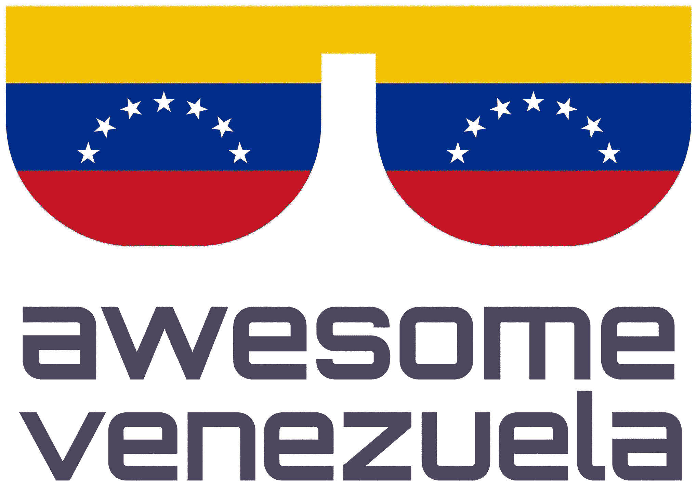

# Awesome Venezuela 🇻🇪

  

  
  

  

Una colección de proyectos open-source creados por developers de Venezuela. Este es un showcase del talento y los proyectos open-source interesantes que surgen de la comunidad dev venezolana en diferentes áreas de la tecnología.

## Contenido

- [Sistemas y Runtimes](#sistemas-y-runtimes)
- [P2P y Finanzas](#p2p-y-finanzas)
- [DevOps y Tools](#devops-y-tools)
- [Web y Librerías](#web-y-librerías)
- [Aplicaciones Móviles](#aplicaciones-móviles)
- [OSINT y Social](#osint-y-social)
- [Creadores de Contenido](#creadores-de-contenido)
- [Proyectos Legacy e Inactivos](#proyectos-legacy-e-inactivos)

## Sistemas y Runtimes

### [Nodepp](https://github.com/NodeppOfficial/nodepp)
**Creador:** [EDBCREPO](https://github.com/EDBCREPO)

Este runtime de C++ te permite escribir código asíncrono que corre en cualquier lugar, desde un pequeño microcontrolador hasta un cloud server. Omite las virtual machines y los garbage collectors para hablar directamente con el hardware, lo que mantiene el uso de recursos increíblemente bajo.

### [MicroCoreOS](https://github.com/theanibalos/MicroCoreOS)
**Creador:** [theanibalos](https://github.com/theanibalos)

Creado para el desarrollo asistido por IA, este microkernel utiliza un enfoque estricto de "un archivo, un feature". Genera un system manifest en vivo llamado `AI_CONTEXT.md` en el boot, dándole a los AI agents exactamente el contexto que necesitan para construir nuevos features sin romper la arquitectura.

## P2P y Finanzas

### [LNp2pBot](https://github.com/lnp2pBot/bot)
**Creador:** [grunch](https://github.com/grunch)

Este bot de Telegram maneja trades de Bitcoin peer-to-peer usando la Lightning Network sin tocar nunca tus fondos. Utiliza "hold invoices" como un escrow trustless, lo que significa que los trades solo se liquidan cuando ambas partes confirman el pago en fiat.

### [Mostro](https://github.com/MostroP2P/mostro)
**Creador:** [grunch](https://github.com/grunch)

Mostro ejecuta un exchange P2P descentralizado sobre la Lightning Network y Nostr. Se enfoca en la resistencia a la censura y la privacidad, permitiendo un trading libre de KYC con un sistema de disputas integrado que funciona sin una autoridad central.

## DevOps y Tools

### [AppJail](https://github.com/DtxdF/AppJail)
**Creador:** [DtxdF](https://github.com/DtxdF)

Framework para manejar jails de FreeBSD como los containers modernos. Sirve para automatiza tareas complejas de networking y deployment a través de un setup modular que no interfiere con la configuración central del host.

### [Anylinux-AppImages](https://github.com/pkgforge-dev/Anylinux-AppImages)
**Creador:** [Samueru-sama](https://github.com/Samueru-sama)

Estas AppImages están diseñadas para correr en prácticamente cualquier distro de Linux, incluso en las más antiguas. Empaquetan cada dependency y usan un sistema inteligente de fallback para asegurar que el software siga funcionando sin importar el setup del host.

### [TatSu](https://github.com/neogeny/TatSu)
**Creador:** [apalala](https://github.com/apalala)

Generador de parsers PEG que convierte gramáticas EBNF en código Python ejecutable. A diferencia de otros sistemas, puede manejar reglas que se refieren a sí mismas directamente sin entrar en bucles infinitos, y construye árboles de sintaxis (AST) para facilitar el análisis de datos complejos.

## Web y Librerías

### [remix-auth-auth0](https://github.com/danestves/remix-auth-auth0)
**Creador:** [danestves](https://github.com/danestves)

Este plugin añade soporte de Auth0 a las apps de Remix manejando todo el ciclo de OAuth2. Te da control total sobre los tokens y las session cookies, haciendo más fácil integrar seguridad de nivel enterprise en los proyectos web.

## Aplicaciones Móviles

### [BoomingMusic](https://github.com/mardous/BoomingMusic)
**Creador:** [mardous](https://github.com/mardous)

Reproductor de música para Android ligero, rápido y repleto de funciones con un diseño Material You moderno. Ofrece soporte para letras sincronizadas palabra por palabra (TTML/LRC), un ecualizador de 15 bandas con perfiles AutoEq e integración nativa con Android Auto.

## OSINT y Social

### [OSINT-D2](https://github.com/Doble-2/osint-d2)
**Creador:** [Doble-2](https://github.com/Doble-2)

Tool de OSINT que reúne información pública basada en usernames y emails. Utiliza un pipeline asíncrono e IA para analizar la raw data y generar perfiles estructurados, permitiendo la exportación de los resultados a formato PDF o HTML.

## Proyectos Legacy e Inactivos

Estos proyectos están archivados, inactivos o se consideran legacy.

| Proyecto | Creador | Descripción | Última Actividad |
| :--- | :--- | :--- | :--- |
| [Hunter](https://github.com/milmazz/hunter) | [milmazz](https://github.com/milmazz) | Librería client de Elixir para Mastodon y plataformas compatibles con GNU social. | Hace 4 años |
| [Turpial](https://github.com/satanas/Turpial) | [satanas](https://github.com/satanas) | Client de microblogging ligero con interfaces Gtk, Qt y CLI. | Hace 10 años |
| [ForthOS](https://github.com/jdinunzio/forthos) | [jdinunzio](https://github.com/jdinunzio) | Sistema operativo x86 experimental y Forth interpreter construido desde cero. | Hace 17 años |
| [Doom Nvim](https://github.com/doom-neovim/doom-nvim) | [NTBBloodbath](https://github.com/NTBBloodbath) | Framework de configuración modular para Neovim. Actualmente en un proceso importante de refactor y rewrite. | Hace 3 años |

## Creadores de Contenido

### [DaveOps](https://www.youtube.com/@DaveOps/)
Contenido técnico sobre DevOps, Cloud y herramientas de infraestructura.

### [Daniela Barazarte (Ingeniela)](https://www.youtube.com/@ingeniela/)
Ingeniería de software y comunicación tecnológica. Co-fundadora de Innovamente.

### [AnibalOS](https://www.youtube.com/@AnibalOS/)
Exploración de Homelab, Self-Hosting, Linux y automatización.

## Contribuir

Por favor, lee las [Guías de Contribución](CONTRIBUTING.es.md) para conocer los detalles sobre cómo añadir un proyecto a esta lista y los criterios que se aplican. Al participar, también aceptas cumplir con el [Código de Conducta](CODE_OF_CONDUCT.es.md).

¡Gracias por ayudar a mostrar el talento venezolano!